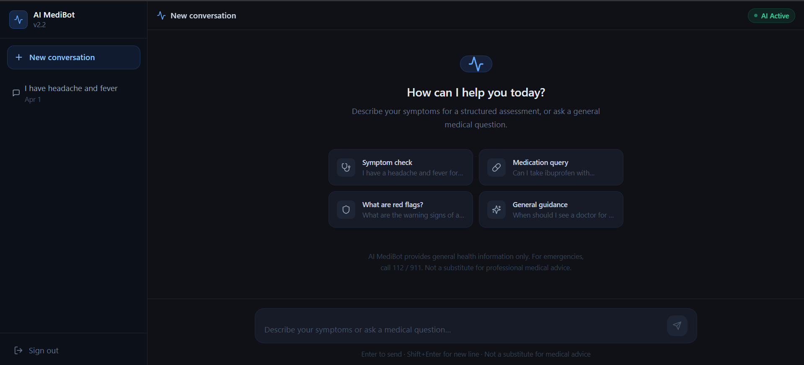

# 🏥 AI MediBot v2.2 — Intelligent Medical Reasoning Assistant

> **Production-grade · Modular · Safe · Explainable**

A full-stack AI medical assistant built with a **structured 8-step reasoning pipeline**, deterministic safety layer, and modern chat UI.

---

## 🧠 TL;DR

* Full-stack AI-powered medical assistant
* 8-step explainable reasoning pipeline
* Deterministic safety layer (no hallucination risk for emergencies)
* Works **offline** or with real LLMs (OpenAI, HuggingFace, etc.)
* Built with **FastAPI + Next.js + Docker**

---

md
## 🚀 Demo

### 🖥️ Chat Interface



---

## 💡 Problem

Traditional symptom checkers are:

* ❌ Opaque (no reasoning visibility)
* ❌ Unsafe (LLM hallucinations)
* ❌ Not explainable

---

## ✅ Solution

AI MediBot introduces:

* ✔ Structured reasoning pipeline (step-by-step AI decisions)
* ✔ Deterministic safety layer (no LLM dependency for emergencies)
* ✔ Transparent confidence scoring + explanations

---

## ✨ Features

* 🔍 Symptom extraction (LLM + fallback)
* ⚠️ Risk classification (AI + rules hybrid)
* 🚨 Red flag detection (**zero LLM dependency**)
* 📚 RAG-based medical knowledge retrieval
* 💬 Chat UI with structured response cards
* 📊 Confidence scoring & explainability
* 🔌 Multi-LLM support (OpenAI, HuggingFace, Anthropic, Ollama)

---

## ⚡ Quick Start

### 1. Setup environment

```bash
cp .env.example .env
```

> On Windows:

```powershell
copy .env.example .env
```

---

### 2. (Optional) Enable real AI

Edit `.env`:

```env
LLM_PROVIDER=openai
OPENAI_API_KEY=your_api_key_here
```

---

### 3. Run with Docker

```bash
docker-compose up --build
```

---

### 4. Open app

http://localhost:3000

---

## 🛠️ Tech Stack

* **Backend:** FastAPI, SQLAlchemy, PostgreSQL
* **Frontend:** Next.js 14, TypeScript
* **AI:** OpenAI, HuggingFace, Sentence Transformers
* **Infra:** Docker, Docker Compose
* **Logging:** structlog

---

## 🧠 AI Pipeline (Core Innovation)

Every user message passes through **8 structured steps**:

1. Symptom Extraction
2. Risk Classification
3. 🚨 Red Flag Detection (NO LLM)
4. RAG Retrieval
5. Condition Prediction
6. Advice Generation
7. Confidence Scoring
8. Explanation Generation

👉 Each step is **independent, testable, and explainable**

---

## 🛡️ Safety Architecture

Three independent layers ensure reliability:

| Layer                | Description                | LLM Dependency |
| -------------------- | -------------------------- | -------------- |
| Red Flag Detection   | Emergency keyword rules    | ❌ None         |
| LLM Safety Prompting | Safe reasoning constraints | ✔ Yes          |
| Output Filtering     | Medical disclaimers        | ❌ None         |

---

## 🔌 LLM Provider Switching

Switch providers using `.env` only:

```env
LLM_PROVIDER=openai
OPENAI_API_KEY=sk-...
```

Also supports:

* HuggingFace
* Anthropic
* Ollama / local models
* Offline fallback mode

---

## 🗄️ Database

| Table             | Purpose               |
| ----------------- | --------------------- |
| users             | Authentication        |
| conversations     | Chat sessions         |
| messages          | Chat history          |
| decision_logs     | Full pipeline outputs |
| medical_documents | RAG knowledge base    |

---

## 🌐 Deployment

This project can be deployed on:

* Render
* AWS (EC2 + RDS)
* GCP

Requires:

* Docker support
* Environment variables configured

---

## 🧪 Testing

```bash
docker-compose exec backend pytest tests/ -v
```

---

## 📊 Observability

* Structured JSON logs
* Per-step latency tracking
* Pipeline-level tracing

---

## 🆚 Improvements (v1 → v2.2)

* Monolithic logic → modular pipeline
* Hardcoded prompts → external prompt files
* Free text → strict output schema
* Weak safety → deterministic safety layer
* No structure → production-grade architecture

---

## ⚠️ Medical Disclaimer

AI MediBot is for **informational purposes only**.

It does NOT:

* Diagnose conditions
* Prescribe treatment
* Replace medical professionals

👉 In emergencies, contact local emergency services immediately.

---

## 📄 License

MIT License

